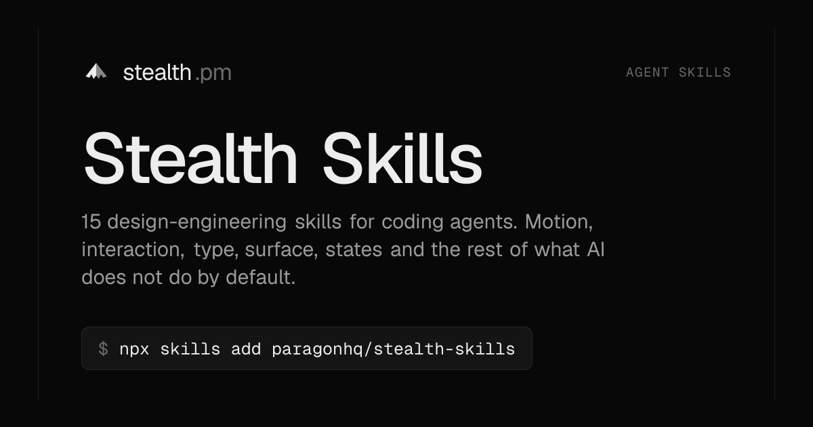

<a href="https://stealth.pm/skills"></a>

# Stealth Skills

Design-engineering skills for coding agents. Fifteen `SKILL.md` files that teach an agent the things it does not do by default: when *not* to animate, how to set type, which states a screen needs, what a press should feel like, how to review an interface with evidence instead of taste.

Distilled from the resources kept at [stealth.pm](https://stealth.pm), written here. Works with Claude Code, Cursor, Codex, Copilot and anything else that reads the [Agent Skills](https://agentskills.io) format.

```bash
npx skills add paragonhq/stealth-skills
```

## Why

Agents ship interfaces that work and look generated. Five font sizes on one screen. `transition: all 0.3s`. A spinner over everything. "Oops! Something went wrong!" A hover effect that lifts every card four pixels. None of it is wrong enough to fail a test, and all of it compounds into software nobody wants to use.

The fix is not more prompting. It is the same thing that fixes a junior designer: the order to make decisions in, the values that are known to work, and a list of the mistakes to stop making. That is what a skill is.

These are opinionated. They pick one curve, one accent, two type sizes, sentence case. Where they disagree with your codebase, the codebase wins; every skill says so.

## Install

All of them:

```bash
npx skills add paragonhq/stealth-skills
```

One:

```bash
npx skills add paragonhq/stealth-skills --skill motion
```

No CLI? Every skill is a plain markdown file. Copy `skills/<name>/SKILL.md` into your agent's skills directory, or point the agent at the raw URL:

```
https://stealth.pm/skills/<name>/SKILL.md
```

## The skills

Start with `stealth`. It sets the posture and tells the agent which of the others to load.

| Skill | What it decides |
| --- | --- |
| [**stealth**](skills/stealth/SKILL.md) | The design-engineering posture and the order decisions get made in. Load this first. |
| [**review**](skills/review/SKILL.md) | A strict interface audit: a file, a line and a fix for every finding, capped at fifteen, with a verdict. |
| [**space**](skills/space/SKILL.md) | Spacing scale, density, alignment, widths, rhythm, responsive without five breakpoints. |
| [**type**](skills/type/SKILL.md) | Two scales, hierarchy without size, leading and tracking by size, tabular numbers, font loading. |
| [**surface**](skills/surface/SKILL.md) | Neutrals and tokens, borders versus shadows by theme, one accent, contrast that passes, both themes. |
| [**ux-copy**](skills/ux-copy/SKILL.md) | Buttons that are verbs, errors that say what to do, empty states with one action, no exclamation marks. |
| [**a11y**](skills/a11y/SKILL.md) | HTML first, names, keyboard, focus, contrast, forms, and a five-minute screen-reader test. |
| [**interaction**](skills/interaction/SKILL.md) | The moment after the click: press, hover, focus, drag, latency, undo over confirm. |
| [**motion**](skills/motion/SKILL.md) | Whether to animate at all, then tool, property, curve, duration, spring, origin, interruption, exit. |
| [**states**](skills/states/SKILL.md) | Loading, empty, error, partial, stale and success, all designed before the happy path ships. |
| [**components**](skills/components/SKILL.md) | Primitive or hand-rolled, the full state matrix, APIs by composition, which library for which job. |
| [**agent-ui**](skills/agent-ui/SKILL.md) | Streaming, thinking, tool calls, approvals, citations, the composer, scroll pinning, honesty. |
| [**mobile-feel**](skills/mobile-feel/SKILL.md) | Targets, `dvh`, safe areas, sheets, the keyboard, momentum, a real mid-range phone. |
| [**scroll-and-webgl**](skills/scroll-and-webgl/SKILL.md) | Spectacle on a budget: scroll scenes, Lenis, split text, canvas, shaders, and the fallbacks. |
| [**polish**](skills/polish/SKILL.md) | The last ten percent as a checklist you run before shipping. |

## How they are written

Every skill follows the same shape so an agent can use it without reading it twice:

1. **A gate.** The question that can end the task with zero code. Should this animate? Is this a review or a build?
2. **The order.** Decisions in the sequence where a later one cannot fix an earlier one.
3. **Values.** Tables of durations, sizes, ratios, tokens. Nothing approximated; nothing to invent.
4. **Anti-patterns.** What generated UI does, and what to do instead, side by side.
5. **A checklist.** The ship gate.
6. **From the catalogue.** The essays, tools and people the skill was distilled from, so you can go deeper than the summary.

Read one of them and you will recognise the voice: short, declarative, no hedging. That is on purpose. An agent given options picks the average.

## Using them well

- Load `stealth` for any interface work; it will name the others it needs.
- Load `review` on existing work before touching it. Fix what it lists, in order.
- The skills extend your codebase's tokens and conventions. They do not replace them. If you see a skill fighting your design system, the design system wins.
- They are written for the web first. `mobile-feel` covers the web on a phone, not native apps.

## Contributing

Corrections, sharper values and missing anti-patterns are welcome. Read [CONTRIBUTING.md](CONTRIBUTING.md) first: the bar is a decision an agent gets wrong without the change, shown with an example, not a preference.

## Related

- [stealth.pm](https://stealth.pm) — the catalogue these are distilled from: 350+ tools for design engineers, and the people worth learning from.
- [emilkowalski/skills](https://github.com/emilkowalski/skills) and [jakubkrehel/skills](https://github.com/jakubkrehel/skills) — the skills that showed this format works. Use them alongside these.
- [agentskills.io](https://agentskills.io) — the format.

## License

[MIT](LICENSE). Made by [Paragon](https://www.paragongroup.co).
